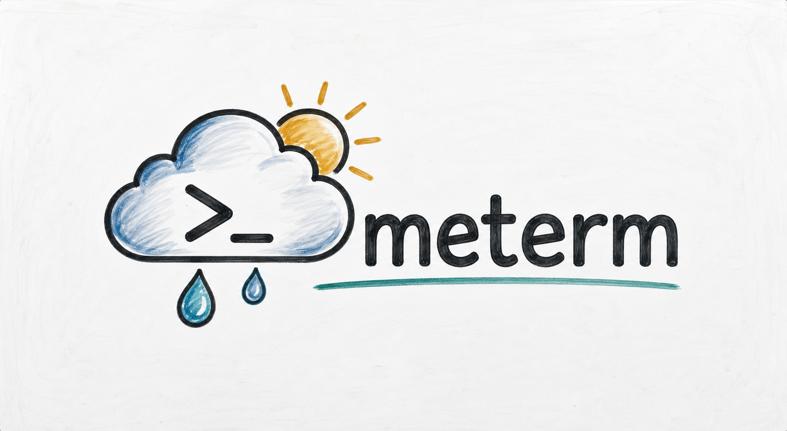

# meterm

<p align="center">
  
</p>

<p align="center">A Rust terminal user interface for weather forecasts.</p>

<p align="center">
  <a href="https://github.com/emidiomorgia/meterm/actions"></a>
  <a href="https://github.com/emidiomorgia/meterm/releases"></a>
  <a href="LICENSE"></a>
  <a href="https://www.rust-lang.org/"></a>
</p>

`meterm` is an early-stage Rust project for a terminal weather interface. The project foundation and development workflow are being established now; features and packaged releases will be documented as they become available.

## Progress

| Milestone | Description | Status |
| --- | --- | --- |
| v0.1 — Project Foundation | Establish the initial Rust project structure and development workflow | In progress |

## Setup

### Prerequisites

- [Rust](https://www.rust-lang.org/tools/install) stable, including Cargo
- Git

Clone the repository and enter its directory:

```bash
git clone https://github.com/emidiomorgia/meterm.git
cd meterm
```

Build, run, and test the project with Cargo:

```bash
cargo build
cargo run
cargo test
```

These commands describe the intended Rust project workflow while the initial project foundation is still in progress.

## Releases and downloads

Published versions will be available on the [GitHub Releases page](https://github.com/emidiomorgia/meterm/releases). No packaged release is available yet.

| Platform | Download |
| --- | --- |
| Linux x86_64 | _TBD — release link not available yet_ |
| macOS Apple Silicon | _TBD — release link not available yet_ |
| macOS Intel | _TBD — release link not available yet_ |
| Windows x86_64 | _TBD — release link not available yet_ |

## Contributing

Please use [GitHub Issues](https://github.com/emidiomorgia/meterm/issues) to report problems or propose focused improvements. For approved work, create a dedicated feature branch from the current `main` branch, make the smallest change that addresses the issue, and add or update tests where applicable. Open a Pull Request against `main` with a clear summary, verification details, and the related issue. Changes are reviewed before they are merged.

There is currently no `CONTRIBUTING.md` file; this section is the project’s initial contribution guidance.

## Community standards

`CODE_OF_CONDUCT.md` is not present yet. **Placeholder:** a Code of Conduct will be added before the project establishes a broader contributor community.

## License

meterm is available under the [MIT License](LICENSE).
